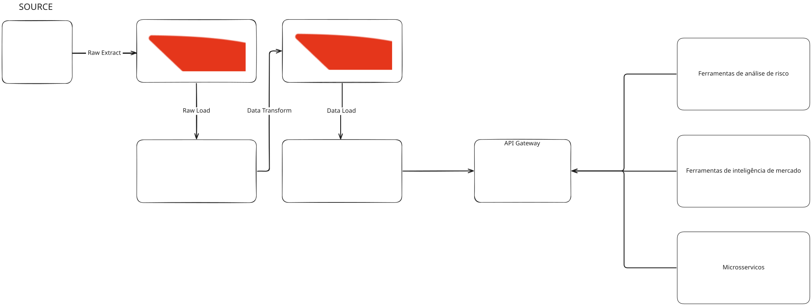

#Introducao

O Cadastro Nacional da Pessoa Jurídica (CNPJ) é o registro que cada entidade jurídica, seja ela uma empresa, fundação, associação ou outra forma de organização, recebe um número de CNPJ único, composto por 14 dígitos que possibilita uma ampla gama de aplicações, desde a realização de estudos acadêmicos sobre o tecido empresarial brasileiro até o desenvolvimento de ferramentas de análise de risco e inteligência de mercado portanto a amplitude das informações contidas nos dados abertos do CNPJ sugere um recurso valioso para quem busca entender o panorama empresarial brasileiro.

#Fonte de dados
Os "Dados Abertos do CNPJ" disponibilizam informações públicas sobre as empresas registradas no Brasil, este conjunto de dados abrange desde informações básicas de registro até detalhes sobre os estabelecimentos, dados relacionados ao regime tributário do Simples Nacional e informações sobre os sócios ou acionistas de cada empresa. Adicionalmente, inclui tabelas de apoio com informações sobre países, municípios, qualificações dos sócios, natureza jurídica das empresas e atividades econômicas (CNAEs).

